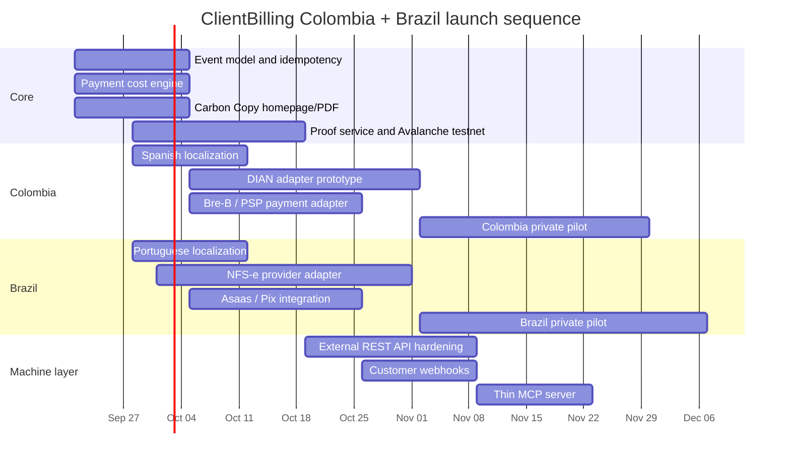

# ClientBilling.com in Colombia and Brazil: Beachhead Strategy for Payment-Aware Invoicing

Status: research input, filed 2026-09-19. Not product policy. Editor's notes by the agent. Decisions in `docs/decisions/` override this document; decision 0024 answers it.

## Editor's notes

**This report proposes a different initial market, not an expansion.** Read it that way. Its recommendation (Colombia as beachhead, Brazil as scale market) would supersede or amend three accepted decisions and change who the company serves:

| Decision | Currently says | The report would need |
| --- | --- | --- |
| 0003 | U.S. service and B2B businesses processing $10K a month or more | Colombian micronegocios and Brazilian MEIs, a different customer at a different size |
| 0014 | No CDG integration, no questions asked, no residual claimed | An inquiry to CDG, and new partners (Asaas, Bold, Wompi) |
| `../mission/north-star.md` | One partner, revisited by decision record, not by drift | Local acquiring partners per country |

It would also require DIAN and NFS-e fiscal adapters, which makes ClientBilling partly a fiscal-compliance product. `north-star.md` and `compliance-boundary.md` are the founder's files; an agent may propose changes by PR and never merge them.

**The founder's answer, 2026-09-19: U.S.-first. LatAm deferred, not rejected.** Decision 0024 records it with revisit triggers based on demonstrated demand rather than a date. Until a trigger fires: no epics, no fiscal-adapter tickets, no Asaas, Bold, or Wompi work, and no `/wayfinder` map against this document.

**Two findings were promoted out of this report, because they do not depend on the pivot:**

1. **FX as a first-class object** (this report, "FX should be a first-class object"). A U.S. merchant billing a foreign client has the same payment-awareness problem in a currency the model does not represent yet. Folded into epic #32 by 0024, including the distinction between economics estimated before payment and economics realized after reconciliation.
2. **The narrow CDG economics inquiry** (this report, "Monetization, partnerships and the CDG question"). Five questions about attribution and residuals, no API or integration discussion. 0021 already contemplated reopening 0014 for exactly this; 0024 does so.

**Where this report corroborates decisions already made,** which is confirmation and not news: model CDG recurring residuals as $0 (0022), drop any claim that competitors hide their fees (0021, and `scripts/style-check.mjs` now fails on it), and build the event and reconciliation model before the anchoring contract (0021's sequencing).

**One claim in this report is already enforced against.** It says it is "no longer defensible to imply that competitors simply hide payment fees" and proposes a narrower claim. That is decision 0021's position and the style check rejects the old wording repo-wide, so the homepage never carried it.

**The architectural test this report gives us, worth keeping:** if the billing record is country-neutral enough that FX, Pix, Bre-B, cards, ACH, stablecoins, and fiscal documents could eventually attach to it, the core was designed correctly. That benefit is available without building any of those adapters now, and it is the standard to hold epics #32 and #33 to.


## Executive summary

**Recommendation: launch Colombia as the positioning beachhead and Brazil as the scale market immediately behind it.** Build one underlying ClientBilling platform, not two country products. Colombia should be the first place where the thesis is proven end-to-end—professional invoice, fiscal record, payment choice, fee/FX transparency, reconciliation, and independently verifiable event history. Brazil should follow in parallel because its addressable market is dramatically larger, Pix is already the dominant everyday payment rail, and Brazil is in the middle of a unusually important NFS-e standardization window. Brazil’s national NFS-e becomes mandatory for Simples Nacional micro and small businesses on **November 1, 2026**, with API-based issuance explicitly supported. citeturn21search1turn21search0

The opportunity is not “free electronic invoicing.” Both governments already undermine that proposition. DIAN offers Colombian electronic invoicing software with unlimited invoice generation and a free digital certificate, while Brazil's national NFS-e service is itself free. citeturn4search0turn21search0

The opportunity is instead:

> **ClientBilling is the payment-aware layer between doing the work and knowing what you actually kept.**

That is more specific than accounting software, more neutral than a processor, and more commercially useful than a generic invoice generator.

The strongest product loop is:

**work → invoice → fiscal record → choose payment rail → get paid → reconcile fee/FX → verified history**

That positioning improves on the current prototype without discarding it. The existing Carbon Copy design already contains the right primitives: a client copy, a file copy with a sourced rail-by-rail cost comparison, an agent-readable API representation, and a “Verified record” whose language correctly says that Avalanche can prove the record existed unchanged but does **not** prove that money moved. fileciteturn0file0

There is, however, one positioning claim I would revise. It is no longer defensible to imply that competitors simply “hide” payment fees. Wompi, Bold, Asaas, Conta Azul and others publish substantial portions of their pricing. Wompi, for example, publicly advertises 2.65% + COP 700 + VAT for its advanced plan and 1% for its QR option; Asaas and Conta Azul also publish transactional prices. citeturn21search16turn15search1turn11search0 The differentiated claim is narrower and stronger:

> **ClientBilling compares what independent payment methods cost on the invoice before you choose one, with every rate sourced and dated.**

That is a product capability rather than a marketing superlative.

### Market verdict

| Factor | Colombia | Brazil | Strategic reading |
|---|---:|---:|---|
| Addressable freelancer/microbusiness market | Large | **Very large** | Brazil wins scale |
| Cross-border service-invoice pain | **Very high** | High | Colombia is cleaner first wedge |
| Instant-payment opportunity | Bre-B, rapidly emerging | **Pix, already massive** | Brazil wins maturity |
| Fiscal invoicing complexity | Medium-high | High and changing | Colombia is somewhat easier now |
| API/agent competition | Relatively open | **Already competitive** | Colombia better for agent positioning |
| Public processor-partner monetization | Unclear/moderate | **Promising via Asaas** | Brazil better partner upside |
| 2026 timing catalyst | Bre-B rollout | **NFS-e national mandate** | Both have strong timing |
| Recommended role | **Beachhead** | **Scale market** | CO first, BR close behind |

Colombia's 24-city DANE micronegocio study counted roughly **2.43 million micronegocios in 2025**; in Q2 2026, the number of micronegocios was still growing 0.5% year over year while nominal revenue rose 14.0%. Professional, real-estate and communications activities were among the positive contributors. citeturn1search0turn22search5 Colombian service exports reached **US$5.34 billion in Q1 2026, up 11.3%**, including **US$874.7 million of “other business services,” up 11.7%**—particularly relevant to consultants, technical providers, agencies and similar ClientBilling customers. citeturn22search0

Brazil is an order of magnitude larger. The federal government reported more than **25 million active enterprises in 2026**, while a separate 2026 MEMP publication counted roughly 16 million MEIs, 8.5 million microenterprises and 1.4 million small enterprises. IBGE estimated **26.1 million self-employed workers in 2025**, up 2.4% from 2024. citeturn19search6turn19search17turn19search1 Brazilian service exports reached a record **US$51.8 billion in 2025**, according to the MDIC service-trade panel. citeturn20search3

My conclusion is therefore not Colombia *or* Brazil. It is:

**Colombia validates the category. Brazil scales it.**

## Market structure, regulation and the underserved workflow

### Colombia

Colombian businesses that are obligated to invoice generally must invoice electronically; DIAN validates electronic invoices and uses the CUFE as a key document identifier. DIAN allows businesses to use its free solution, their own software, or a technology-provider route. citeturn4search2turn4search4turn4search6

This is precisely why ClientBilling should **not** attempt to win by being “a better free DIAN invoice generator.” DIAN already offers free unlimited issuance and a free digital certificate. citeturn4search0

The interesting gap appears when the customer invoices internationally. DIAN's current guidance requires applicable system documents to be represented in **Spanish and Colombian pesos**, while permitting another language and foreign currency as additional information. citeturn5search0 Export-of-services tax treatment also depends on conditions such as the service being used abroad and on retaining appropriate supporting documentation; ClientBilling therefore should collect evidence and flags, but should not make the user's tax determination without a rules engine reviewed by Colombian tax counsel. citeturn5search2

That gives ClientBilling a useful data model:

```text
Commercial invoice
USD 2,500
        │
        ├──── Client-facing amount/currency
        │
        ▼
Colombian fiscal representation
COP [amount]
DIAN validated
CUFE [...]
        │
        ▼
Payment
Bre-B / PSE / Card / Wire
        │
        ▼
Settlement
gross amount
- payment fee
- fee VAT if applicable
- FX cost/spread
= actual proceeds
        │
        ▼
ClientBilling record
invoice → fiscal document → payment → settlement
```

The Colombian payment environment makes that workflow more compelling now than it would have been two years ago. Bre-B entered mass operation in October 2025. By April 2026 it had accumulated **more than 34 million registered users, more than 670 million transactions and over COP 105 trillion in value**, with more than 103 million registered aliases. Banco de la República says the next stages include more B2B payments, collections and supplier/payroll uses. citeturn22search1turn22search8

Bre-B is not one merchant API that ClientBilling simply connects to at Banco de la República. It is interoperable infrastructure exposed through participating financial institutions and immediate-payment systems; Banco de la República's July 2026 participant list includes banks, cooperatives and providers including Bold. citeturn22search10turn22search15 That means ClientBilling should implement **Bre-B through PSP/bank adapters**, not pretend to be a direct participant.

This is a favorable architecture. ClientBilling remains neutral.

### Brazil

For a service-focused ClientBilling, the important Brazilian acronym is **NFS-e**, the electronic service invoice, rather than designing primarily around the goods-oriented NF-e ecosystem. Brazil's national NFS-e formally records service provision, is legally valid nationwide, can be issued through the government web/mobile interfaces or by API after the required credentialing, and the government service itself is free. citeturn21search0

The timing is exceptional. Receita Federal's updated August 2026 rule makes the national-standard NFS-e mandatory for Simples Nacional micro and small enterprises beginning **November 1, 2026**, via either the national issuer or API. citeturn21search1

At the same time, Brazil's consumption-tax reform is changing the fiscal schema. NFS-e technical notes already contain new IBS/CBS fields and rules, while Simples Nacional treatment of CBS and IBS becomes effective beginning January 1, 2027. citeturn21search3turn21search4turn21search12

That creates both an opportunity and a warning:

> **Brazil is unusually attractive in late 2026, but hardcoding today's fiscal schema would be reckless.**

The fiscal layer needs to be an adapter with versioned schemas.

Pix provides the other half of the opportunity. Banco Central statistics showed more than **170 million Pix users**, more than **7 billion transactions in May 2026**, and more than R$3 trillion in May transaction value. citeturn7search2 Pix Cobrança supports immediate and due-date charges, QR/copy-and-paste payment and API-enabled reconciliation; BCB explicitly positions it as a lower-cost collection alternative to boleto while allowing PSPs to provide the commercial layer. citeturn7search0

For a Brazilian freelancer or small agency, the conceptual product is therefore beautifully simple:

```text
NFS-e issued
     │
     ▼
Client receives invoice + Pix QR
     │
     ▼
Pix arrives
     │
     ▼
Webhook identifies exact charge
     │
     ▼
ClientBilling matches NFS-e ↔ payment
     │
     ▼
Fee + net proceeds recorded
     │
     ▼
Invoice marked settled
```

This is much closer to a real business problem than “blockchain invoicing” or “AI invoicing.”

### The cross-border service wedge

For both countries, ClientBilling should specifically pursue businesses that **sell expertise rather than inventory**:

software developers, designers, digital agencies, recruiters, consultants, engineers, architects, fractional executives, marketing firms, AI implementation firms and other professional-service businesses.

Colombia is particularly attractive because foreign-currency commercial billing and COP fiscal representation coexist. Brazil has the larger service-export base—US$51.8 billion in 2025—but also a much stronger domestic software/payments ecosystem. citeturn5search0turn20search3

The high-value question ClientBilling should answer is not:

> “Can I make an invoice?”

It is:

> **“I billed a U.S. customer US$4,000. What record do I need locally, how can they pay me, and how much will I actually have after payment and currency conversion?”**

That is the niche.

## Competitors, payment rails and the real gap

### Product and pricing comparison

Pricing below is current public pricing located during this research and should be stored internally with `source_url`, `effective_or_checked_at`, currency, tax treatment and a version rather than copied permanently into product logic.

| Market / provider | Public entry pricing or transaction pricing | Fiscal/invoice capability | Payments | API / automation | ClientBilling implication |
|---|---|---|---|---|---|
| **Alegra – Colombia** | Electronic-invoicing plan starts around **COP 17,900/mo**; higher tiers scale with monthly revenue and users. citeturn8search0 | DIAN electronic invoicing, digital certificate and accounting ecosystem. citeturn8search0turn8search3 | Integrations rather than neutral cost comparison | API and invoice webhooks are available. citeturn13search16turn13search17 | Do not compete as accounting software |
| **Siigo – Colombia** | Free e-invoicing offering is limited to **5 documents**; paid packages extend the product. citeturn10view0 | Strong DIAN/accounting proposition | Mercado Pago collection available in free offer. citeturn10view0 | Increasing automation/AI capability | Established incumbent; not the wedge |
| **Wompi – Colombia** | Advanced plan **2.65% + COP 700 + VAT** per successful transaction; published QR rate **1%**. citeturn21search16 | No replacement for DIAN fiscal invoicing | Cards, Bancolombia, Nequi, QR and other methods | APIs/webhooks; payment APIs support modern integration patterns. citeturn13search20turn13search3 | Good rail adapter; compare rather than replace |
| **Bold – Colombia** | Online card pricing publicly advertised around **3.59% + COP 900**, with conditions and additional international-card pricing. citeturn8search9 | Payments, not fiscal-accounting core | Cards, PSE and newer QR/Bre-B-oriented flows | API/webhook support; its API documentation includes Bre-B QR capabilities. citeturn13search0turn13search1turn13search14 | Attractive Bre-B integration candidate |
| **Conta Azul – Brazil** | ERP plans start in the hundreds of reais monthly; its Control plan is displayed from roughly **R$349.90/mo on annual commitment**. citeturn11search11 | NFS-e/financial-management automation | Publishes Pix, boleto and card collection fees | Integrated ERP workflow | Strong incumbent, but processor-centric |
| **Asaas – Brazil** | No basic monthly platform fee; after introductory pricing, published examples include **R$1.99 boleto** and **2.99% + R$0.49** for one-installment card payments. citeturn15search1turn11search2 | NFS-e automation available | Pix, boleto, card, subscriptions, split | Excellent API, white label, webhooks and BaaS. citeturn15search4turn15search3 | Best current Brazil infrastructure/partner candidate |
| **NFE.io – Brazil** | NFS-e API plans found from about **R$190/mo for up to 250 documents**, with higher tiers for more volume. citeturn12search3 | Fiscal API specialist | Not primarily payment rail | APIs **and an MCP offering for fiscal tasks**. citeturn12search0 | Important proof that “agent invoicing” alone is not defensible |
| **Government systems** | DIAN and Brazil national NFS-e are free. citeturn4search0turn21search0 | Authoritative fiscal rails | No neutral payment optimization | APIs/integration routes exist | ClientBilling should sit above them |

The key competitive correction is that **the API gap is not simply “these products lack APIs.”** They increasingly do not.

Alegra exposes invoice-related webhooks. Wompi has webhooks and idempotent payment APIs in parts of its developer platform. Bold has API/webhook payment infrastructure. Asaas explicitly documents at-least-once webhook delivery and recommends event-ID-based idempotency. citeturn13search16turn13search3turn13search1turn15search3 And NFE.io already markets an MCP layer for fiscal operations in Brazil. citeturn12search0

So ClientBilling's agent thesis needs to mature from:

> “We have an API and MCP.”

to:

> **“One idempotent billing record connects the human invoice, fiscal document, payment economics, payment event, settlement and proof.”**

That is harder to copy.

### Rail economics and reconciliation

| Rail | Country | Speed / settlement | Public cost example | What ClientBilling must reconcile |
|---|---|---|---|---|
| **Bre-B** | Colombia | Immediate-payment infrastructure, operating 24/7 through participating entities. citeturn22search1turn22search14 | Institution/provider-specific rather than one universal ClientBilling rate | Invoice ID, Bre-B reference/QR, amount, institution event, received amount |
| **Wompi QR** | Colombia | Provider-managed | Published special rate **1%** on current advanced pricing. citeturn21search16 | Gross, processor charge, VAT on fee where applicable, payout |
| **Wompi cards** | Colombia | Processor settlement terms | **2.65% + COP700 + VAT** published advanced-plan rate. citeturn21search11turn21search16 | Gross, percentage fee, fixed fee, VAT, net settlement |
| **Bold online/card** | Colombia | Processor settlement terms | Public rate schedule begins around **3.59% + COP900** for cited online methods. citeturn8search9 | Same; preserve actual provider statement over estimates |
| **Pix** | Brazil | Immediate; 24/7 underlying rail | PSPs may charge business recipients; BCB does not impose one universal merchant retail rate. citeturn7search8turn7search0 | `txid`, gross, provider fee, net, timestamp |
| **Asaas Pix** | Brazil | Pix collections can become available immediately. citeturn15search1 | Public provider tariff applies according to account/current pricing | Charge ID, Pix event, provider fee, net |
| **Asaas boleto** | Brazil | Asaas says paid boleto balance generally becomes available in **1 business day**. citeturn15search0turn15search1 | Standard published rate after promotion around **R$1.99**. citeturn15search1 | Document, payment event, settlement date, fee |
| **Asaas card** | Brazil | Standard card receivables are generally available **32 calendar days after confirmation of each installment**, absent anticipation. citeturn15search0turn15search1 | One-installment standard example **2.99% + R$0.49** after introductory period. citeturn15search1 | Gross, installments, MDR, anticipation fee if any, settlement |
| **Conta Azul Pix** | Brazil | Pix rail | Published **R$2.49 per paid Pix charge** in cited pricing. citeturn11search5 | Same reconciliation problem, but inside Conta Azul |
| **Conta Azul card** | Brazil | Provider-dependent | Published link pricing **3.99% + R$0.29**, plus additional installment pricing. citeturn11search0 | Gross-to-net settlement |

The product opportunity is therefore not simply “cheaper payments.” It is **normalizing the different economics**.

For every payment option, ClientBilling should model:

```text
invoice amount
payment currency
rail
percentage fee
fixed fee
tax on processor fee
FX conversion rate
FX explicit fee
estimated settlement date
estimated proceeds

then, after payment:

actual gross received
actual processor fee
actual tax
actual FX rate
actual payout
variance versus estimate
```

That final `variance` field is important. It turns fee comparison from content marketing into an auditable product.

### FX should be a first-class object

Do not represent FX as one mysterious “fee.”

Use:

```json
{
  "sourceCurrency": "USD",
  "sourceAmount": "2500.00",
  "settlementCurrency": "COP",
  "referenceRate": "...",
  "referenceRateSource": "...",
  "referenceRateTimestamp": "...",
  "providerRate": "...",
  "explicitFxFee": "...",
  "grossSettlement": "...",
  "netSettlement": "..."
}
```

For Colombia, the distinction is particularly important because the commercial invoice can contain foreign-currency information while DIAN's fiscal document rules require COP representation. citeturn5search0

ClientBilling should **never silently choose the legally applicable tax exchange rate**. It can source candidate/reference rates and explain them, while the fiscal adapter/accounting configuration determines the accepted rate.

## Monetization, partnerships and the CDG question

The business should have **three revenue engines**, but only one should be regarded as controllable at launch.

| Engine | Reliability | Role |
|---|---|---|
| Free human invoicing → organic/SEO acquisition | High product control, no direct revenue | Funnel |
| Paid automation/API/agent tier | **Highest controllability** | Core recurring SaaS |
| Processor/referral residuals | Potentially high, contract-dependent | Upside / second flywheel |

The mistake would be valuing the business as though processor residuals already exist.

### CDG Commerce

CDG publicly operates a reseller channel and explicitly says that independent partners are central to its sales model. citeturn23search9 Its current public online flat-rate pricing is **3.50% + $0.30**, and its published online interchange-plus markup is **0.35% + $0.15 above interchange**. citeturn14search0turn14search1 That validates the rate examples in the current ClientBilling prototype. fileciteturn0file0

What its public pages reviewed for this report **do not establish is your actual residual contract**. The public reseller page confirms a channel but does not publish a residual schedule, duration or tail. citeturn23search9

Until the answer is in writing:

> **Model CDG recurring residual revenue as $0.**

The narrow CDG email should ask only these questions:

| Question | Why it matters |
|---|---|
| Is compensation a one-time bounty, ongoing residual, or both? | Determines whether the flywheel exists |
| If residual, what is the precise basis: processing volume, markup, net processing revenue, gateway revenue, or another measure? | Needed for unit economics |
| How long are residuals paid while a referred merchant remains active? | Defines lifetime value |
| What happens to the residual if our partner agreement ends? Is there a contractual tail? | Determines whether “perpetual” is real |
| How is attribution established—link/cookie, registered lead, merchant ID, sales-office code? | Determines technical tracking |
| Does attribution survive a merchant switching CDG pricing plans? | Critical because ClientBilling itself recommends plans |
| Which merchant domiciles/geographies qualify under our existing partner arrangement? | Determines whether this can apply to Colombia/Brazil or only another segment |
| What reporting do we receive by merchant and month? | Required for reconciliation |

A good email is almost exactly:

> **Subject: Two questions on our reseller account**  
> We are building ClientBilling.com and expect to refer merchants to CDG. Before we plan the commercial release, could you confirm:  
>   
> 1. whether our account pays an ongoing residual, one-time referral compensation, or both, including the basis and duration of any residual; and  
> 2. how a merchant is attributed to us and whether that attribution/residual survives plan changes and termination of our reseller agreement.  
>   
> We are not asking about API or product integration yet—just the economics and attribution terms.

That answer is more valuable right now than a CDG API meeting.

### Brazil is more promising for a local revenue partner

Asaas is the most interesting partner uncovered in this research.

Its current official partner page explicitly offers **remuneration**, separates **technology/integration partners** from **distribution/referral partners**, supports customized commercial arrangements, and says remuneration varies by partnership model and business volume. citeturn23search3

That is materially more useful than a consumer referral code.

Asaas also exposes white-label infrastructure, Pix/card/boleto creation, split payments, NFS-e automation and subaccounts. citeturn15search4turn23search12 Its split system can distribute a fixed or percentage amount to participating Asaas wallets after Asaas fees, showing that the infrastructure can support platform economics if the commercial agreement permits the intended use. citeturn15search2

I would pursue **two Asaas conversations**, conceptually:

**Channel arrangement:** ClientBilling refers Brazilian businesses and receives agreed remuneration.

**Technology arrangement:** ClientBilling becomes an integrated billing front end, creates charges and perhaps subaccounts through Asaas, while ClientBilling remains visibly the billing product.

The official program does not publicly promise a perpetual residual. Its page says remuneration depends on the model and volume, with details disclosed during onboarding. citeturn23search3 So again: negotiate, do not assume.

### Colombia partner options are less certain

Bold has a formal referral program, but its current published terms are not the residual business you want. Participation requires being invited, the referred merchant must satisfy conditions including acquiring a new Bold device, and Bold can terminate the program on seven days' notice. citeturn21search17 That is a promotion, not a durable revenue moat.

Wompi is strategically valuable as a rail because it publishes useful pricing and provides developer infrastructure, but I did not find a public recurring-residual schedule in the official material reviewed for this report. Its economics should therefore be considered **negotiated/unknown**, not residual revenue. citeturn21search16turn13search20

The better Colombia pitch to Wompi or Bold is not “give us an affiliate link.” It is:

> **ClientBilling can become an acquisition and activation layer for service businesses choosing payment rails invoice by invoice. What channel or rev-share program can you offer for merchants originated and activated through us?**

### A warning from Brazil

Conta Azul provides a useful lesson about building around affiliate economics: its partner materials changed remuneration policy in 2026, discontinuing one compensated-billing mechanism for new referrals while grandfathering prior recommendations for a limited period. citeturn11search8

That reinforces the operating rule:

> **Only call revenue “recurring” when a signed agreement makes it recurring.**

The paid machine tier should exist regardless.

A sensible initial model is:

**Free:** create/send invoices, PDF/public page, basic reminders, manual payments, cost comparison, CSV export, verification.

**Automation:** recurring schedules, advanced reminders, integrations, fiscal automation, automated reconciliation.

**Developer / Agent:** API keys, webhooks, MCP, higher limits, service accounts, event history and bulk operations.

Do not charge human freelancers simply because DIAN or the Brazilian government provides a free fiscal invoice. Charge for **time saved and automation**, not statutory compliance itself.

## Positioning, localization and the Carbon Copy brand

The Carbon Copy direction becomes stronger in Latin America when the “copies” stop being merely visual.

The system can genuinely produce different views of one billing record:

```text
                 ONE BILLING RECORD
                        │
          ┌─────────────┼─────────────┐
          ▼             ▼             ▼
     CLIENT COPY    FISCAL COPY   VERIFIED COPY
     human-facing   DIAN / NFS-e   cryptographic
     invoice        official       event proof
          │             │             │
          └─────────────┼─────────────┘
                        ▼
                 AGENT / API COPY
```

The current prototype already hints at exactly this system: page 3 uses a restrained verification strip on the client PDF; page 4 turns the file copy into the detailed merchant record; page 5 treats the verified record as “the third copy.” fileciteturn0file0

I would preserve that model.

I would **not** translate “Carbon Copy” literally as the main Colombian or Brazilian marketing concept. The visual identity can carry the historical reference; the local-language copy should explain the benefit directly.

### Colombia positioning

Primary:

> **Facture a sus clientes. Sepa cuánto le cuesta cobrar.**

Secondary:

> Envíe facturas profesionales, mantenga su registro fiscal y compare cuánto recibe por cada forma de pago.

Carbon-copy proposition:

> **Tres copias. Un solo registro.**  
> La del cliente. La de su contabilidad. La que prueba qué ocurrió y cuándo.

Cross-border landing page:

> **Cobre en dólares. Lleve el registro en Colombia.**  
> Facture a clientes internacionales, mantenga la información fiscal correspondiente en pesos y reconcilie cuánto terminó recibiendo.

That page should target terms around service exports, USD invoices, freelancers/independent professionals, DIAN invoices for foreign customers and international client billing—not generic “software contable.”

### Brazil positioning

Primary:

> **Cobre seus clientes. Saiba quanto custa receber.**

Secondary:

> Emita sua cobrança, mantenha a NFS-e ligada ao pagamento e compare Pix, cartão e outros meios antes de escolher.

Carbon-copy proposition:

> **Três vias. Um só registro.**  
> A do cliente. A da contabilidade. A que comprova o histórico.

Pix landing page:

> **Da NFS-e ao Pix, sem perder o rastro.**  
> Gere a cobrança, identifique o pagamento e saiba quanto realmente entrou.

The key Brazilian marketing noun should probably be **cobrança**, not an indiscriminate translation of “invoice.” Fiscal **NFS-e** and commercial **billing/cobrança** should be treated as linked but distinct objects. Brazil's official service itself describes NFS-e as the digital document formalizing service provision. citeturn21search0

### Sample Colombian invoice PDF

The merchant should control whether cost comparisons are visible to the payer. In most professional situations, I would show payment options on the client copy and keep detailed margin economics on the file copy.

```text
CLIENTBILLING                                      COPIA DEL CLIENTE

FACTURA / INVOICE #CB-1042
Servicios de consultoría

Proveedor
Estudio Norte S.A.S.
NIT [NIT]

Cliente
Example Corporation
United States

Emitida                19 Sep 2026
Vence                  19 Oct 2026

Servicios profesionales                     USD 2,500.00

Referencia comercial                         USD 2,500.00
Valor fiscal                                  COP [amount]
Tasa utilizada                                [rate]
Fuente / fecha                                [source · timestamp]

DIAN
Estado                                         Validada
CUFE                                           [CUFE]

CÓMO PAGAR

Bre-B / transferencia en COP                  COP [amount]
Pago internacional                            USD 2,500.00
Tarjeta                                       disponible en línea

Elija el medio de pago en:
clientbilling.com/i/[token]

REGISTRO CLIENTBILLING

✓ Registro de esta versión comprobable
CB-7F2A-91C8 · versión 1

ClientBilling conserva una prueba criptográfica independiente
de esta versión. No se publican en la cadena los datos de la
factura ni del cliente.

Verificar registro →
```

The **file copy** adds:

```text
QUÉ CUESTA RECIBIR ESTE PAGO

Método       Tarifa          Costo estimado      Neto estimado
Bre-B        [source]        [amount]             [amount]
Tarjeta      [source]        [amount]             [amount]
Transfer.    [source]        [amount]             [amount]

Cada tarifa incluye fuente y fecha de consulta.
Los valores estimados se reemplazan por el costo real al conciliarse.

CONCILIACIÓN

Facturado                         USD 2,500.00
Conversión                        [provider / rate]
Bruto recibido                    COP [...]
Tarifa del medio de pago          COP [...]
IVA sobre tarifa                  COP [...]
Costo de cambio                   COP [...]
Neto recibido                     COP [...]
```

### Sample Colombian verification UI

```text
ClientBilling
VERIFICACIÓN DEL REGISTRO

✓ Registro comprobado

Documento           Factura #CB-1042
Versión             1
Creado              19 Sep 2026 · 14:31 COT
Huella              7a8d45f19d0e24c2…
Anclado             19 Sep 2026 · 19:35 UTC
Red                 Avalanche C-Chain
Transacción         0x93a8…71cf

Qué demuestra esta prueba

Esta prueba demuestra que ClientBilling tenía esta versión del
registro y que no ha cambiado desde el anclaje indicado.

No demuestra que un pago bancario o con tarjeta haya ocurrido.
La institución financiera o el procesador sigue siendo la
autoridad sobre el movimiento de fondos.

Ningún nombre, correo, NIT, valor de factura ni descripción del
servicio se almacena en Avalanche.
```

### Sample Brazilian invoice/payment PDF

```text
CLIENTBILLING                                         VIA DO CLIENTE

COBRANÇA #CB-2048
Serviços de desenvolvimento

Prestador
Studio Norte Tecnologia Ltda.
CNPJ [CNPJ]

Cliente
Example Corporation

Emissão                19/09/2026
Vencimento             19/10/2026

Serviços profissionais                         R$ [amount]

DOCUMENTO FISCAL

NFS-e                                           Emitida
Chave / identificador                          [...]
DANFSe                                          Ver documento →

COMO PAGAR

Pix
Escaneie o QR Code ou use Pix Copia e Cola

[ QR ]

Pix Copia e Cola
[ payload ]

Outros meios de pagamento
clientbilling.com/i/[token]

REGISTRO CLIENTBILLING

✓ Esta versão possui um registro criptográfico verificável.
Nenhum conteúdo da nota ou dado do cliente é publicado
na blockchain.

Verificar registro →
```

And the Brazilian file copy:

```text
QUANTO CUSTA RECEBER

Meio          Tarifa             Prazo estimado       Líquido
Pix           [provedor]         imediato              R$ [...]
Boleto        [provedor]         [prazo]               R$ [...]
Cartão        [provedor]         [prazo]               R$ [...]

Fonte de cada tarifa: [provider · checked date]

Após a liquidação, ClientBilling substituirá as estimativas
pelos valores efetivamente cobrados e recebidos.
```

This is the localized expression of the original tagline rather than an unrelated country redesign.

## Technical architecture, agent layer and Avalanche proof

### System architecture

```mermaid
flowchart TD
    H[Human Web App]
    A[REST API]
    M[MCP Server / Agent]
    
    H --> B[Billing Core]
    A --> B
    M --> B

    B --> I[Invoices & Versions]
    B --> E[Append-only Billing Events]
    B --> F[Fee / Rail Engine]
    B --> X[FX Ledger]

    I --> CO[Colombia Fiscal Adapter]
    I --> BR[Brazil Fiscal Adapter]

    CO --> DIAN[DIAN / Technology Provider]
    BR --> NFSE[National NFS-e / Fiscal Provider]

    B --> P[Payment Orchestrator]

    P --> BRE[Bre-B via PSP / Bank]
    P --> WOM[Wompi]
    P --> BOLD[Bold]
    P --> PIX[Pix via PSP]
    P --> ASAAS[Asaas]

    DIAN --> W[Webhook / Status Ingestion]
    NFSE --> W
    WOM --> W
    BOLD --> W
    ASAAS --> W
    PIX --> W

    W --> R[Reconciliation Engine]
    R --> E
    R --> F
    R --> X

    E --> C[Canonicalization + Commitment]
    C --> MT[Merkle Batch]
    MT --> AN[Anchor Worker]
    AN --> AVAX[Avalanche C-Chain]

    MT --> PR[Proof Store]
    AVAX --> PR
    PR --> V[/verify endpoint]
```

The architectural rule should be:

> **No compliance provider, processor, blockchain RPC or affiliate system is allowed to become the billing system of record.**

Postgres remains the authoritative application record.

### Core schema

The minimum persistent model should contain:

| Table / aggregate | Purpose |
|---|---|
| `organizations` | Seller/business and jurisdiction |
| `clients` | Customer identity |
| `invoices` | Stable commercial invoice identity |
| `invoice_versions` | Immutable versions of economic/document contents |
| `line_items` | Service/product economics |
| `fiscal_documents` | DIAN/NFS-e identity, state, XML/PDF references and validation |
| `payment_options` | Rail offered on a particular invoice |
| `payment_intents` | Processor-side collection instruction |
| `payments` | Economic payment event |
| `settlements` | What actually arrived |
| `payment_fees` | Processor/fixed/tax/other fees |
| `fx_conversions` | Source amount, target amount, reference/provider rates |
| `billing_events` | Append-only history |
| `inbound_webhooks` | Original provider event and processing status |
| `idempotency_keys` | Safe API retries |
| `merkle_batches` | Batch/root/chain anchor |
| `event_proofs` | Leaf, nonce, Merkle path and anchor reference |
| `api_keys` / `service_accounts` | Human/system/agent authority |

### Event design

Every financially meaningful action should create an append-only event:

```json
{
  "event_id": "evt_01...",
  "schema_version": 1,
  "organization_id": "org_...",
  "aggregate_type": "invoice",
  "aggregate_id": "inv_...",
  "event_type": "payment.settled",
  "actor": {
    "type": "processor",
    "id": "asaas"
  },
  "occurred_at": "2026-09-19T19:31:14Z",
  "provider_event_id": "...",
  "previous_event_hash": "...",
  "payload_hash": "..."
}
```

Actor types should include at least:

```text
user
agent
api_key
scheduled_job
processor
fiscal_provider
system
```

This is where the agent strategy becomes genuinely useful. An AI agent issuing an invoice should not be represented as indistinguishable from the account owner.

An agent event should say something like:

```json
{
  "actor": {
    "type": "agent",
    "id": "collections-agent-18",
    "authorization_id": "auth_72891"
  }
}
```

### Idempotency is mandatory, not an “agent feature”

Every externally mutable `POST` should support an `Idempotency-Key`.

Internally:

```text
(org_id, idempotency_key) UNIQUE

request_hash
resource_type
resource_id
response_status
response_body_hash
created_at
expires_at
```

A reused key with the identical body returns the original result. A reused key with a different request body returns a conflict.

Incoming payment/fiscal webhooks should additionally be deduplicated on the provider's stable event ID. That behavior matches real payment environments: Asaas explicitly documents at-least-once webhook delivery, meaning duplicates can occur and should be handled idempotently. citeturn15search3turn15search5

### The MCP server should stay thin

Expose perhaps:

```text
list_customers
create_invoice
get_invoice
send_invoice
list_overdue_invoices
send_reminder
get_payment_options
get_payment_status
record_external_payment
get_verification_status
```

Do **not** build a separate agent accounting system.

NFE.io's current MCP product is evidence that “MCP for invoices” will rapidly commoditize in Brazil. citeturn12search0 ClientBilling's differentiation should instead be that the same agent call goes through:

**idempotency → authorization → fiscal workflow → rail economics → event log → verifiable proof.**

### Avalanche architecture

The current prototype has the conceptual language right but the implementation should be tightened.

Do **not** write one transaction per invoice or one transaction per payment.

Do **not** put an invoice hash without additional privacy protection directly into a public contract.

Do **not** put customer identity, email, tax number, invoice number, invoice amount, payment amount, description, processor ID or ClientBilling organization ID on-chain.

Avalanche's C-Chain is intentionally transparent: public transactions and contract interactions can be inspected. citeturn16search2 C-Chain is EVM-compatible and reaches roughly one-second or sub-second irreversible finality according to Avalanche's current documentation. citeturn16search6turn16search7 Its fee market is dynamic; after the 2025 fee changes, the minimum base fee can be extremely low and normal-load base fees are described as well below 1 nAVAX, but actual transaction cost remains a function of gas usage and network conditions. citeturn16search1

Use a **salted commitment + Merkle batch**:

```text
Canonical Event
      │
      ▼
canonical bytes
      │
      ├── random 256-bit nonce
      │
      ▼
SHA-256(
  "CLIENTBILLING_EVENT_V1" ||
  nonce ||
  canonical_event
)
      │
      ▼
Merkle leaf

leaf 1 ─┐
leaf 2 ─┤
leaf 3 ─┤
...     ├── Merkle tree ── ROOT
leaf n ─┘                    │
                            ▼
                    Avalanche C-Chain
```

A batch can close on either threshold:

```text
5 minutes
OR
1,000 leaves
```

whichever occurs first.

That means 100,000 billing events need not create 100,000 Avalanche transactions. They can create perhaps hundreds of batches depending on traffic and batching policy.

### On-chain contract

Keep it boring:

```solidity
event BatchAnchored(
    uint256 indexed batchId,
    bytes32 indexed merkleRoot,
    uint32 leafCount
);
```

The contract does not need invoices, tokens, wallets for customers, NFTs or a mutable registry.

The anchor worker submits:

```text
batch ID
Merkle root
leaf count
```

The blockchain already supplies transaction/block provenance and time context.

### Cost controls

Never advertise “each record costs $0.00X” because C-Chain gas and AVAX/USD vary. Avalanche itself documents C-Chain's dynamic base-fee mechanism. citeturn16search1

Instead:

```text
estimateGas()
get current base + priority fee
calculate max anchor cost

if cost <= configured threshold:
    anchor
else:
    leave batch pending
    retry later
```

Invoicing, fiscal issuance and payment reconciliation **must continue even if Avalanche is completely unavailable**.

Blockchain is an asynchronous evidence service, not part of the critical payment path.

### Proof endpoint

I would change the endpoint from a simple public data page into two modes:

```text
GET /verify/{proof_id}
```

returns non-sensitive metadata:

```json
{
  "status": "verified",
  "proofId": "prf_...",
  "schemaVersion": 1,
  "anchoredAt": "...",
  "chain": "avalanche-c",
  "transactionHash": "0x...",
  "merkleRoot": "0x..."
}
```

Then:

```text
POST /verify/{proof_id}/document
```

accepts a locally hashed/uploaded document or canonical record and verifies:

```text
document → canonical commitment
commitment + Merkle path → root
root → Avalanche transaction
```

Where feasible, the browser should hash uploaded PDFs locally rather than uploading somebody's private invoice simply to verify it.

For invoices, maintain **two hashes**:

```text
semantic_hash
    canonical invoice data

pdf_hash
    exact generated PDF bytes
```

This avoids a future PDF-renderer update making the underlying commercial record appear altered.

### Privacy and legal posture

This is the most important blockchain constraint.

Brazil's LGPD applies purpose, necessity/data-minimization, transparency and security principles and gives data subjects rights including correction and, in qualifying circumstances, elimination; permitted retention can continue for legal/regulatory obligations and certain other statutory grounds. citeturn17search2turn17search4turn17search8

Colombia's SIC likewise emphasizes purpose limitation, proportionality, authorization where applicable and rights to correction/suppression, subject to legal or contractual retention requirements. citeturn18search0turn18search4turn18search5

That creates an obvious tension with a public immutable ledger.

The practical mitigation is:

**PII off-chain; randomized commitments on-chain; no deterministic business identifiers; deletable off-chain data; retained Merkle root only.**

A privacy lawyer in each country should still review whether a salted commitment that ClientBilling can relink remains personal data in the specific deployment. The product should not rely on the marketing claim “it's only a hash, therefore privacy law doesn't apply.”

Most importantly, preserve the wording already present in the Carbon Copy prototype:

> The proof demonstrates that the ClientBilling record existed unchanged at that time; **the processor or bank remains authoritative about whether money moved.** fileciteturn0file0

That distinction protects both product integrity and credibility.

## Roadmap, risk controls and prioritized execution

### Market-specific MVPs

The Colombian MVP should contain:

| Capability | Colombia MVP |
|---|---|
| Invoice creation | Spanish/English, COP + commercial foreign currency |
| Client PDF/page | Professional, bilingual option |
| Fiscal | DIAN adapter; status, CUFE, graphical representation |
| Payments | External bank/Bre-B, plus one API payment partner |
| First processor | Evaluate Bold vs Wompi on API economics; do not wait for both |
| Payment-aware | Rate source/date + estimated fee/net |
| Cross-border | USD commercial amount + COP fiscal record + FX ledger |
| Reconciliation | Manual external payment + automatic selected-provider webhook |
| Proof | Event log + Merkle/Avalanche batch |
| Developer | REST + webhooks + idempotency |
| Agent | Thin MCP on same API |
| Monetization | Free core + automation tier + negotiated processor referral |

The Brazilian MVP should contain:

| Capability | Brazil MVP |
|---|---|
| Interface | Portuguese |
| Billing | `cobrança` distinct from fiscal NFS-e |
| Fiscal | National NFS-e adapter, initially through abstraction/provider if necessary |
| Payments | Pix dynamic QR first |
| First PSP | **Asaas is the strongest research-backed candidate** |
| Reconciliation | Pix webhook → charge → invoice → settlement |
| Comparison | Pix vs boleto vs card economics |
| Tax schema | Versioned NFS-e, ready for 2027 IBS/CBS fields |
| Proof | Same global ClientBilling proof service |
| Developer | Same API with Brazilian fiscal/payment resources |
| Agent | MCP, but do not market it as unprecedented |
| Monetization | Asaas partner economics + paid automation/API |

For Brazil, I would **not wait for a pristine direct NFS-e integration** before piloting. The November 1 mandate is too close, and the national technical rules have continued changing through 2026. citeturn21search1turn21search3turn21search12 Build `FiscalProvider` as an interface so the first implementation can use a partner such as NFE.io/Asaas while a direct national NFS-e implementation is developed and certified behind it.

### Delivery timeline



This schedule deliberately gives webhooks, idempotency and MCP to the same underlying invoice system instead of allowing the agent idea to turn into a separate project.

### Principal risks

| Risk | Severity | Control |
|---|---|---|
| **Becoming a tax-advice product accidentally** | High | Show rules/source; obtain tax counsel; never silently classify export treatment |
| **Brazil fiscal changes during tax reform** | High | Versioned adapters/schema; no tax logic in invoice core |
| **Building free fiscal infrastructure users already get from government** | High | Focus product on payment choice, FX, reconciliation and automation |
| **Processor “residual” turns out to be a bounty** | High | Treat uncontracted residual as zero |
| **Processor changes partner program** | High | Multi-rail design; machine SaaS revenue must stand alone |
| **Blockchain leaks business metadata** | High | Salted commitments, Merkle batching, no PII/amounts/IDs on-chain |
| **“Verified payment” overclaim** | High | Say “verified record”; processor/bank is payment authority |
| **Agent duplicate or unauthorized financial actions** | High | Idempotency, scoped keys, actor identity, limits and approval policies |
| **Reconciliation estimates disagree with actual payout** | Medium | Preserve estimated and actual separately; calculate variance |
| **Free-plan abuse/email/PDF costs** | Medium | Reasonable quotas/rate limits without destroying free proposition |
| **Incumbents replicate fee comparisons** | Medium | Build neutral multi-provider data, fiscal links, FX and evidence—not just calculator UI |
| **Crypto branding reduces trust** | Medium | Sell “verified record,” not blockchain; Avalanche appears at technical-detail level |

### Prioritized actions

**The first commercial action is still the CDG email.** The technology does not answer whether that revenue engine exists. CDG's official materials confirm a reseller channel but not your residual terms. citeturn23search9

**The first Brazil partnership action should be Asaas.** Its official program explicitly seeks technology/integration and distribution partners, says partners can generate new revenue, and provides remuneration based on partnership model and volume. citeturn23search3 Ask specifically for recurring economics, attribution, subaccounts/API arrangements and whether ClientBilling may expose competing rail costs while integrating Asaas.

**The first Colombia payments action should be a technical/commercial comparison of Bold and Wompi rather than a commitment to either.** Wompi has clear public pricing and scale-oriented APIs; Bold is already present within the Bre-B ecosystem and documents Bre-B-oriented QR payment functionality. citeturn21search16turn22search10turn13search14

**The first engineering action should be the event/reconciliation model, not the blockchain contract.** Once invoice versions, provider events, fees, settlements and actors are modeled correctly, Merkle anchoring is straightforward. Building blockchain first would freeze the wrong abstractions.

**The first fiscal action should be adapters, not becoming a fiscal-software company.** Colombia should start through the fastest credible DIAN integration route; Brazil should abstract NFS-e behind a provider interface because its national schema is actively changing and the November 2026 mandate is imminent. citeturn4search6turn21search1turn21search3

**The first SEO pages should be problem pages, not country homepages alone.** The useful acquisition themes are “invoice a US client from Colombia,” “invoice in USD and comply in Colombia,” “Bre-B invoice payment,” “NFS-e with Pix,” “how much does Pix/card cost to receive,” and eventually “invoicing API for AI agents.” The service-export growth and rapid Bre-B adoption make the Colombian cross-border/payment pages particularly timely, while Brazil's NFS-e transition provides a narrow high-intent window. citeturn22search0turn22search1turn21search1

The strategic order I would put into the project document is therefore:

```text
ClientBilling.com
        │
        ▼
FREE PAYMENT-AWARE INVOICING
        │
        ├──────── Colombia ────────┐
        │  USD/COP + DIAN + Bre-B │
        │                          │
        └──────── Brazil ──────────┤
           NFS-e + Pix             │
                                   ▼
                       RECONCILIATION LEDGER
                                   │
                    ┌──────────────┼──────────────┐
                    ▼              ▼              ▼
                Free user     Paid automation   API / agents
                    │              │              │
                    └───────┬──────┴──────┬──────┘
                            ▼             ▼
                    Partner revenue   SaaS revenue
                            │             │
                            └──────┬──────┘
                                   ▼
                         VERIFIED RECORD
                        Avalanche anchoring
```

The crucial sequencing principle is that **blockchain, AI agents and affiliate payments all strengthen the product, but none of them is the product**.

The product is the billing record.

The wedge is:

> **Bill clients. Know what getting paid costs.**

Colombia turns that into **foreign-currency + DIAN + Bre-B + net proceeds**. Brazil turns it into **NFS-e + Pix + automatic reconciliation**. The Carbon Copy system then provides the durable brand logic tying both markets together: one transaction history, different audiences, independently verifiable without making ClientBilling a processor, bank, accounting suite or crypto company.